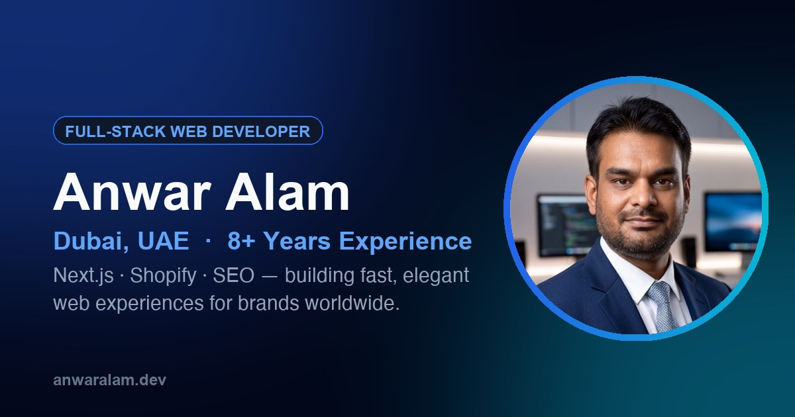

# Anwar Alam — Portfolio

Live at **[iamanwaralam.github.io](https://iamanwaralam.github.io)**



Personal portfolio for Anwar Alam, a full-stack web developer based in Dubai, UAE, specializing in e-commerce and SEO. Built as a fast, animated single-page site with dedicated case studies for real, shipped client and independent projects.

## Tech stack

- **React 19** + **TypeScript**, bundled with **Vite**
- **Tailwind CSS v4** for styling
- **Framer Motion** + **GSAP** for animation
- **React Router** for routing, including per-project case study pages
- React 19's native document metadata (title/meta tags) for per-route SEO — no `react-helmet`
- Deployed to GitHub Pages via GitHub Actions on every push to `main`

## Getting started

```bash
npm install
npm run dev          # start the dev server
npm run build         # type-check and build for production
npm run preview       # preview the production build locally
npm run lint           # run ESLint
npm run type-check     # run TypeScript with no emit
```

## Project structure

```
src/
├── components/   # shared UI, layout, and common components
├── sections/     # homepage sections (hero, projects, experience, contact, …)
├── pages/        # routed pages (case studies, etc.)
├── data/         # site content — projects, case studies, experience, skills
├── animations/   # shared Framer Motion variants
└── styles/       # global CSS and Tailwind setup
```

Project and case-study content lives in `src/data/` as plain TypeScript objects — no CMS, and no invented metrics: every claim in a case study is grounded in what actually shipped.

## Contact

- [LinkedIn](https://www.linkedin.com/in/iamanwaralam/)
- [GitHub](https://github.com/iamanwaralam)
- [X / Twitter](https://x.com/iamanwaralam)
